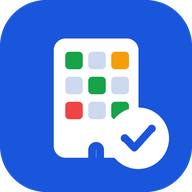
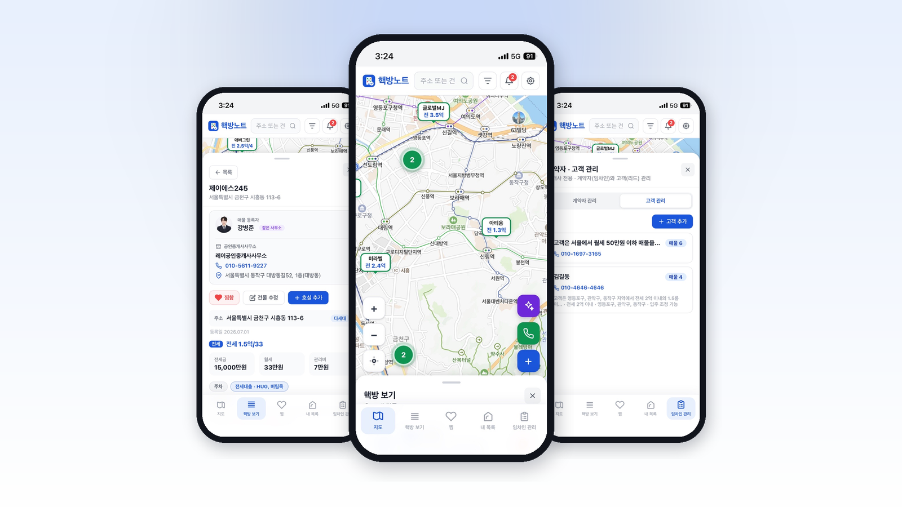
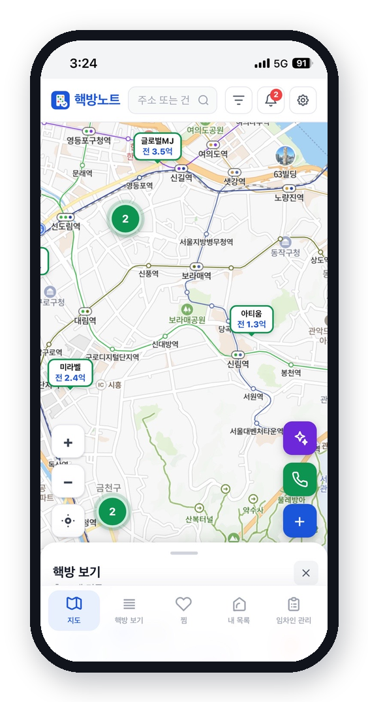
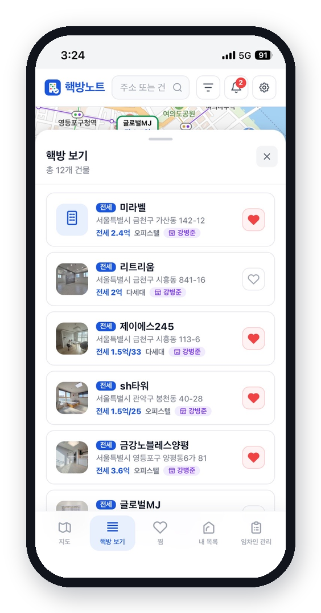
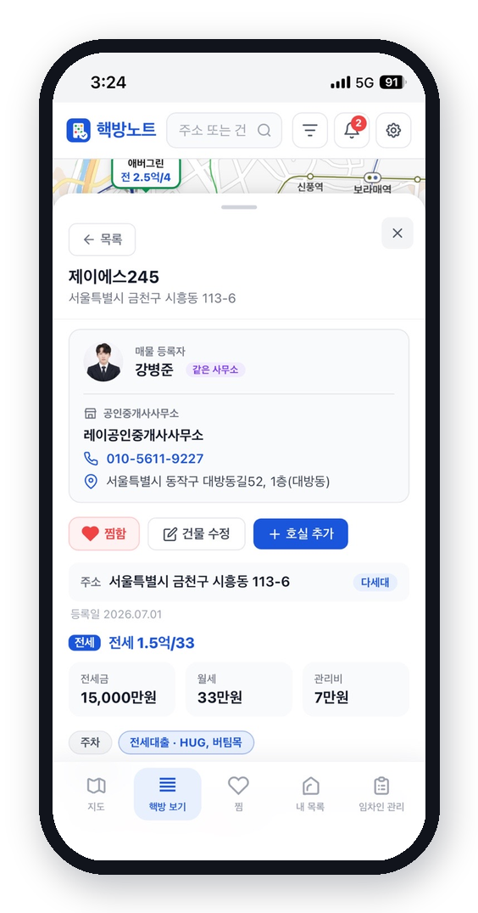
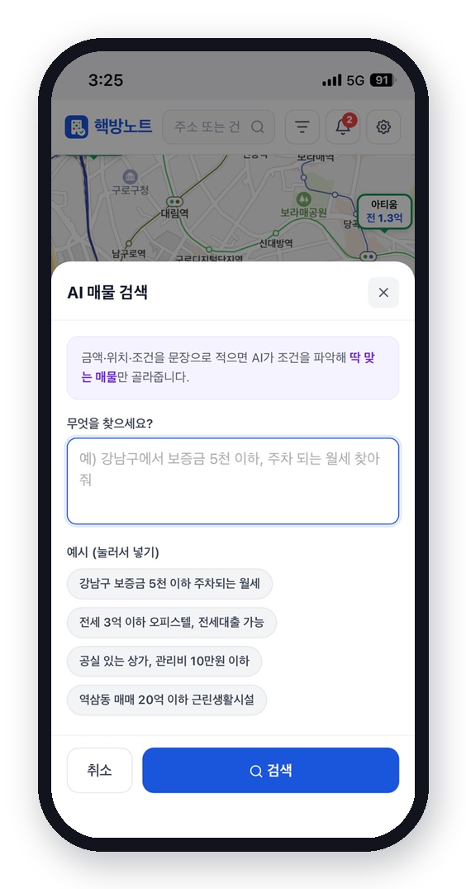
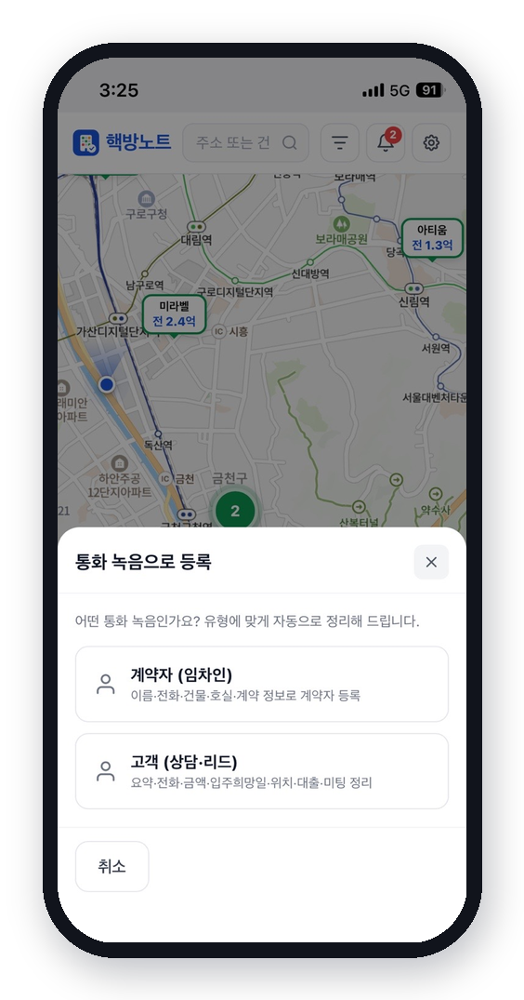
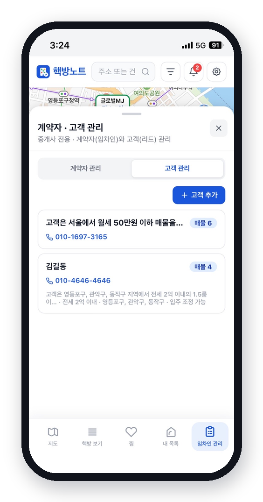
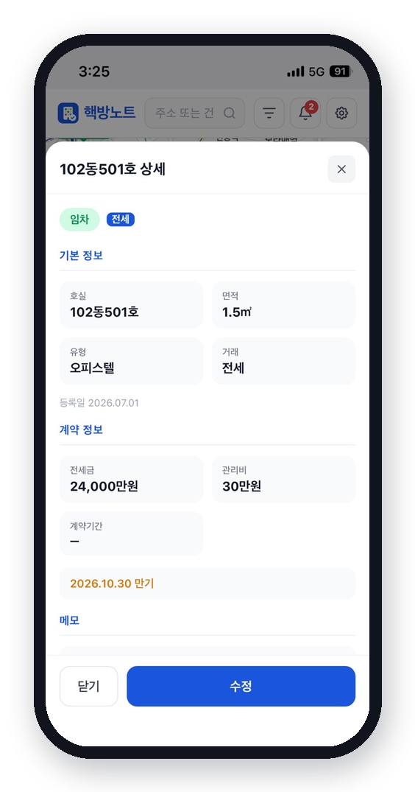
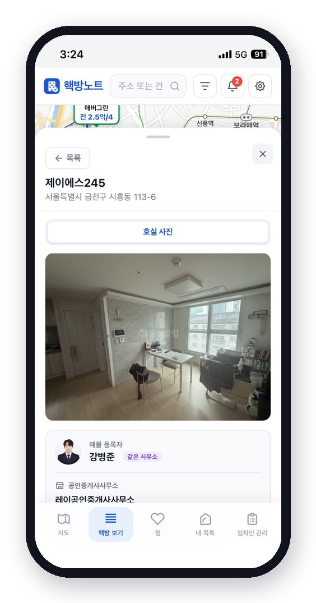

# 핵방노트

### 지도로 보고, 통화로 기록하고, 놓치지 않는 — 공인중개사를 위한 매물·고객 노트

 

 
 

**설치가 필요 없는 웹앱 · 홈 화면에 추가하면 진짜 앱처럼**

지도 한 장에 내 매물을 올려두고, 통화 녹음 한 번으로 고객을 정리하고, 중요한 일정은 알림으로 챙기세요.

 

---

## 핵방노트는 이런 앱이에요

부동산 매물과 고객을 **지도 위에서 한눈에** 관리하는 서비스입니다.
흩어진 매물 정보와 고객 상담 내용을 한 곳에 모아, 중개 업무를 훨씬 가볍게 만들어 줍니다.

- 🗺️ 매물을 **지도에 핀으로** 올리고 가격표로 바로 확인
- 📇 상담 **통화 녹음을 올리면 AI가 자동 정리**
- 🔔 미팅·계약·잔금·입주 일정을 **제때 푸시 알림**으로
- 🏢 같은 사무소 동료와 **매물을 코드 하나로 공유**

 

---

## 주요 기능

### 🗺️ 지도로 보는 매물

내 매물이 지도 위에 **가격표 핀**으로 표시됩니다. 여러 매물이 몰려 있으면 숫자로 묶어서 보여주고, 지도를 움직이며 원하는 동네를 바로 살펴볼 수 있어요.

- 거래유형별(매매·전세·월세) 색상 구분
- 지도를 탭하면 상·하단 메뉴가 사라지는 **몰입 모드**
- 화면 우측 빠른 버튼으로 **AI 검색 · 통화 등록**에 바로 접근

 

### 📋 핵방 보기 · 찜

전체 매물을 목록으로 훑어보고, 마음에 드는 매물은 **하트로 찜**해 두세요. 찜한 매물은 별도 탭에 모여, 고객에게 소개할 매물을 빠르게 추릴 수 있습니다.

- 매물 사진·주소·가격·유형 한눈에
- 하트 한 번으로 찜 등록/해제
- 등록자 표시로 **누구 매물인지** 바로 확인

 

### 🏠 매물 상세 · 호실 관리

건물 하나에 여러 호실을 담아 관리합니다. 보증금·월세·관리비·대출 정보는 물론, **호실 사진**과 **공실표**까지 정리해 둘 수 있어요.

- 건물 → 호실 단위로 상세 관리
- 매물 등록자 · 중개사무소 정보 표시
- 전화번호는 **탭하면 바로 전화 연결**

 

### 🤖 AI 매물 검색

> *"강남구에서 보증금 5천 이하, 주차 되는 월세 찾아줘"*

이렇게 **말하듯 문장으로 검색**하면, AI가 조건을 파악해 딱 맞는 매물만 골라줍니다. 복잡한 필터를 일일이 만질 필요가 없어요.

 

### 📞 통화 녹음으로 등록

고객과 통화한 **녹음 파일을 올리면**, AI가 내용을 듣고 계약자 또는 고객 정보로 **자동 정리**해 줍니다. 이름·전화·금액·희망 지역·입주 시점·대출까지 알아서 채워지니, 상담 후 손으로 옮겨 적을 필요가 없습니다.

- **계약자(임차인)** — 이름·전화·건물·계약 정보로 정리
- **고객(상담·리드)** — 요약·금액·위치·입주희망일·대출·미팅 정리

 

### 👥 계약자 · 고객 관리

계약자와 고객(리드)을 나눠서 관리합니다. 각 고객에게 **어울리는 매물을 연결**해 두면, 다음 상담 때 바로 꺼내 볼 수 있어요.

- 고객별 희망 조건·요약 한눈에
- 고객에게 **관심 매물 여러 개 연결**
- 미팅·본계약·잔금·입주 **일정 등록**

 

### 🔔 놓치지 않는 알림

고객 일정을 등록해 두면 알아서 챙겨 줍니다. **언제 알림을 받을지 직접 설정**할 수 있고, 알림을 누르면 해당 고객으로 바로 이동해요.

- **미팅·본계약** — 시작 1시간 전(원하는 시점으로 조절)
- **잔금·입주** — 당일 지정한 시간에
- 1차 알림은 기본, **2차 알림도 추가** 가능

 

### 🏢 사무소 매물 공유

같은 사무소 동료끼리 **코드 하나로 매물을 공유**합니다. 코드를 만들어 동료에게 알려주거나, 받은 코드로 참여하면 서로의 매물을 함께 보고 관리할 수 있어요. 내 매물과 동료 매물은 배지로 구분됩니다.

 

 

---

## 📲 앱처럼 설치하기 (PWA)

핵방노트는 **별도 설치 없이** 브라우저에서 바로 쓸 수 있고, 홈 화면에 추가하면 일반 앱과 똑같이 전체 화면으로 실행됩니다. **푸시 알림을 받으려면 홈 화면 추가를 권장**합니다.

<table>
<tr>
<td width="50%" valign="top">

### 🍎 iPhone · iPad (Safari)

1. **Safari**로 핵방노트 접속
2. 하단 **공유 버튼**( ↑ ) 탭
3. **‘홈 화면에 추가’** 선택
4. 오른쪽 위 **‘추가’** 탭
5. 홈 화면의 핵방노트 아이콘으로 실행

> 알림을 받으려면 홈 화면에 추가한 앱에서 열어야 해요.

</td>
<td width="50%" valign="top">

### 🤖 Android (Chrome)

1. **Chrome**으로 핵방노트 접속
2. 우측 상단 **⋮ 메뉴** 탭
3. **‘앱 설치’** 또는 **‘홈 화면에 추가’** 선택
4. **‘설치’** 탭
5. 홈 화면/앱 서랍의 아이콘으로 실행

> 설치하면 주소창 없이 전체 화면으로 열려요.

</td>
</tr>
</table>

 

---

## 🔔 알림 켜기

1. 앱 우측 상단 **⚙️ 설정** 진입
2. **푸시 알림** 스위치를 켜기
3. 브라우저(또는 휴대폰)의 **알림 허용**에 동의
4. **알림 시점 설정**에서 일정별로 원하는 시간 지정

설정한 뒤에는 고객 일정만 등록해 두면, 미팅·계약·잔금·입주를 제때 알려 드립니다. 상단 **🔔 아이콘**에서 지난 알림도 다시 볼 수 있어요.

 

---

## 💡 이렇게 쓰면 좋아요

| 상황 | 이렇게 |
| --- | --- |
| 새 매물이 들어왔을 때 | 지도에서 위치 찍고 **호실·사진·가격** 등록 |
| 손님 전화를 받은 뒤 | **통화 녹음 업로드** → AI가 고객으로 정리 |
| 조건에 맞는 매물 찾을 때 | **AI 검색**에 문장으로 요청 |
| 계약 일정이 잡혔을 때 | 고객에 **일정 등록** → 알림으로 리마인드 |
| 동료와 함께 일할 때 | **사무소 코드**로 매물 공유 |

 

---

**핵방노트** — 중개 업무를 더 가볍게

본 문서는 서비스 이용 안내용입니다.

